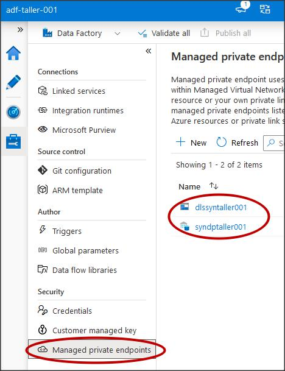

### Integración entre Data Factory & Synapse Analytics

Crear Data Factory con el nombre: **adf-taller-001**

en networking habilitar virtual network y **conectar via public endpoint**

en avanzada lo dejamos por defecto, en la pestaña tags en nombre seleccionamos **Ambiente** con el valor **Analítica Avanzada** y creamos otra en nombre **Proyecto** con valor **Analítica Avanzada** 

revisar y crear

si no tenemos acceso al grupo de recursos sino solo al servicio tenemos que ir 

**Control Access IAM** y asignar el rol de **Data Factory Contributor** para poder guardar las publicaciones que hagamos dentro de Data Factory si le damos siguiente nos pregunta a que le damos ese permiso si a todo un grupo de usuarios, un miembro de la organización, una entidad administrada, otro recurso, o un service principal. escogemos a que suscripción pertenece a lo que queremos dar permiso 

si es otro recurso Ej. otro **Data Factory** elegimos entidad administrada

un **Service Principal** funciona como si fuera un *usuario* al cual usamos para conectar diferentes servicios EJ: un Data Bricks y una Cuenta de Almacenamiento.

ahora creamos dos Private endpoint uno que va hacia el Portal y otro que va al Data Factory

si el Data Factory se desplego con public endpoint lo cambiamos a private endpoint y guardamos.

Nos dirigimos a la pestaña Private endpoint conections agregamos un 

**+ Private endpoint** por lo general lo hacemos en el mismo grupo de recursos en el que esta el Data Factory lo vamos a crear con el nombre **pl-adf-taller-001-datafactory**
Región **EastUS2**, En target sub-resourse elegimos **dataFactory**, por lo general cada grupo de recursos tiene una vnet y una subnet asociada en este caso la vnet es 

**az-anl-dev-vnet-dav-e2-000** y la subnet es **az-anl-dev-snet-dav-adf-e2-000** en DNS elegimos integrar con dns privado que se puede re utilizar para varios Data Factory's si ya esta creado elegimos en que ya esta creado

tags en nombre seleccionamos **Ambiente** con el valor **Analítica Avanzada** y creamos otra en nombre **Proyecto** con valor **Analítica Avanzada** revisar y crear si vamos a el recurso nos muestra el resumen 

en el apartado DNS Configuración encontraremos estos valors que pueden ser usados para el Integration Runtime de tierra para la conectividad

El término Fully Qualified Domain Name (**FQDN**) se refiere a la **dirección completa y única necesaria para tener presencia en Internet**.

ahora hacemos lo mismo para crear el Private endpoint a el Portal en networking con el nombre **pl-adf-taller-001-portal** ahora creamos una entidad administrada dentro de Datafactory en el menú izquierdo nos vamos a Managed identities: vamos a la pestaña User assigned en el botón agregar **+ add** con el nombre **az-trv-dev-kvdav-e2-000**

### Creación de Synapse Analytics

elegimos la suscripción el grupo de recursos y le asignamos a el Workspace el nombre de: **syn-taller-001** region **EastUS2**, ahora en create new creamos un nuevo datalake gen 2 con el nombre: **dlssyntaller001** en file system clic en create new y le damos el nombre de **synapse**

nos sale este mensaje de precaución informándonos que necesita unos roles para el correcto funcionamiento

Creamos el usuario para SQL Server admin login con el valor: **sqltaller**
y SQL Password con el valor: **Bextsa2022*** click en siguiente en network habilitamos redes virtuales y deshabilitamos public network access to workspace endpoints, 

dentro de tags en nombre seleccionemos **Ambiente** con el valor **Analítica Avanzada** y creamos otra en nombre **Proyecto** con valor **Analítica Avanzada** revisar y crear esto tarda entre 10 y minutos 

el workspace de synapse y vamos a data si nos sale este mensaje es porque no tenemos nuestra ip habilitada para acceder a los recursos de Synapse

para solucionarlo abrimos el synapse nos vamos a networking habilitamos el acceso publico a el workspace endpoints y agregamos nuestra ip publica y guardamos

si nos vamos a la cuenta de almacenamiento en la sección de networking private endpoint vemos que el synapse también creo por defecto un private endpoint 

en la columna connection state esta como provisional debemos seleccionarlo y aprobarlo le damos un nombre ej conexión entre synapse y cuenta de almacenamiento ahora si vamos a el workspace de synapse en el icono de administrar en el menú de managed private endpoints vemos tres private endpoints creados 

el primero es la conexión segura hacia el datalake que fue el que aprobamos en la imagen anterior los otros dos los crea por defecto uno es para el **pool de SQL** que *<u>"aun no se ha creado"</u>* y el otro es para el **serverless**.

Identity: **az-trv-dev-kvdav-e2-000**

Create Azure Synapse Analytics (private link hubs): **plepsyntaller001**

Creamos Private EndPoint en la seccion de private endpoint conections y + private endpoint

Asignamos suscripción y grupo de recursos

asignamos el nombre: **plep-syn-taller-001-portal**

en la pestaña de recurso asignamos los valores en la imagen

Asignamos la vnet y subnet en DNS la suscripcion y el grupo de recursos dentro de tags en nombre seleccionemos **Ambiente** con el valor **Analítica Avanzada** y creamos otra en nombre **Proyecto** con valor **Analítica Avanzada** revisar y crear nos dara este resumen

Dentro de synapse creamos estos tres private endpoints 

Private EndPoint: **pl-syn-taller-001-dev**

Private EndPoint: **pl-syn-taller-001-sql**

Private EndPoint: **pl-syn-taller-001-qlodm** los seleccionamos y los aprobamos

para acceder a el espacio de trabajo vamos a networking firewall settings 

marcamos la casilla Allow Azure services and resources to access this workspace también activamos la casilla Enable y agregamos nuestra ip publica

Creamos un contenedor llamado: test y cargar el archivo csv

Enabled from selected virtual networks and IP addresses: Enable

Allow Azure services on the trusted services list to access this storage account: Enable

Aprobar el private Endpoint si esta

Private EndPoint:pl-dls-taller-001-df
Private EndPoint:pl-dls-taller-001-blob

Configure Resource type

Create linked services: lksdlssyntaller001

Permisos al ADF en el DLS con Storage Blob Data Contributor

Create un Copy Data

Create New managed private endpoint: dlssyntaller001 y aprobar

Create DataSet SourceCSv 

Create Contaier: test2 y cargar un csv

Create DataSet TargetCsv

Create un SQL Pool: syndptaller001

Otro Copy Data - Create DataSet: 

SynTable - Create linked services: lkssyndptaller001

Managed private endpoint: syndptaller001 y aprobar

Guardar el secreto en el key vault y Create linked services al Key Vault: lkskvsyntaller001

Dar acceso al KV desde ADF (GET-LIST-SET) y seleccionar el secreto

Edit dbo.Movies

Wildcard paths: /moviesDB.csv

Mapping importar el schema de TargetCsv

Settings - Enable staging

Copy method: Bulk insert

